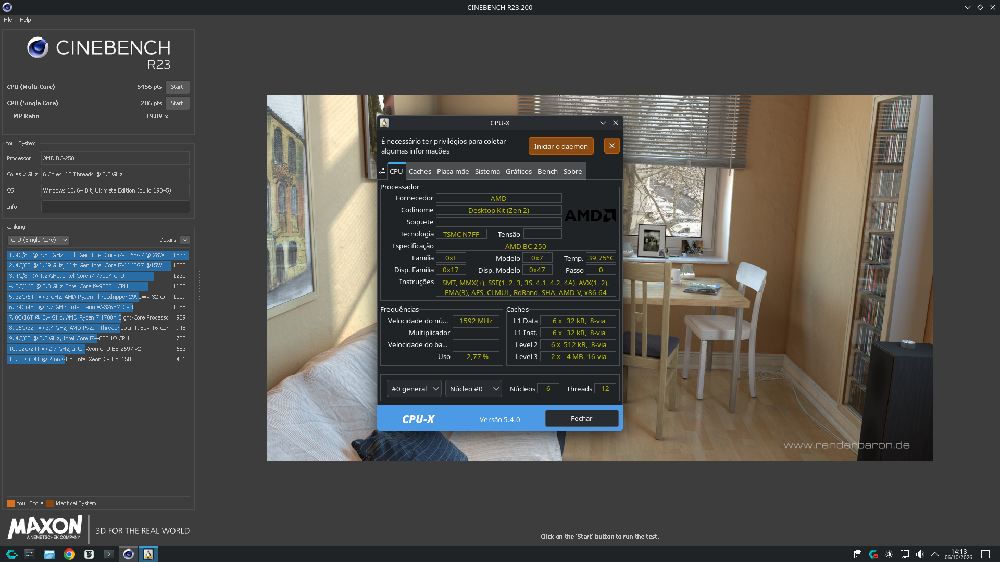
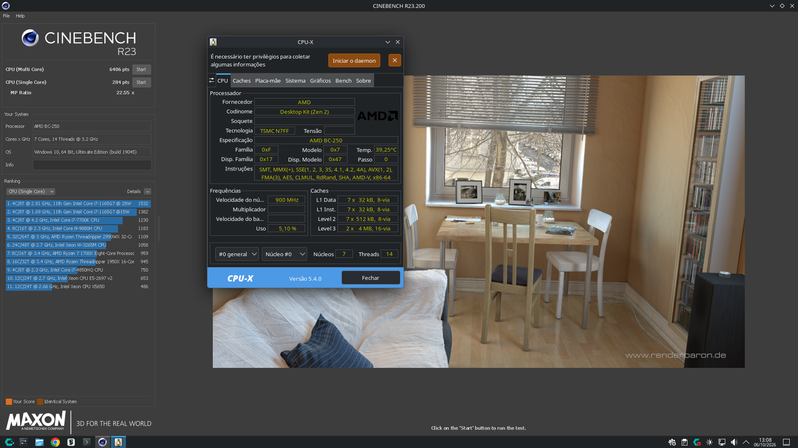

# bc250-7-core-unlock: enable only the good hidden cores of the AMD BC-250

**Languages:** [Português](README.md) · **English** · [Русский](README.ru.md)

Scripts that turn on the CPU cores that ship **hidden from the factory** on the AMD BC-250 (the "PS5 APU" from the mining boards), **choosing which ones**: only the good cores are enabled and the defective one stays parked. It is permanent, survives kernel updates and works together with e-tho's ACPI power fix (P-states/C-states).

On the board it was made on: **12 → 14 threads** (core 7 enabled, defective core 3 parked), 3850 MHz CPU overclock on all 7 cores, stable, and **+17.4% in Cinebench R23 multi core** (5456 → 6406 pts, [details](#benchmark-cinebench-r23-6-vs-7-cores)).

> ⚠ **Use at your own risk.** This touches the SMU (the chip's power-management microcontroller) and the boot CPU table. A hidden core may be hidden **because it is defective**: enabling a bad core can freeze the board or corrupt data. Test each core before making it permanent. Powering the board off and on (cold boot) always returns to the factory state.

> **Note:** the scripts, their messages, the GRUB menu entries and the detailed manuals in `docs/` are in **Portuguese**. Commands and entry names below are shown exactly as they appear on screen.

---

## Contents
- [How it works](#how-it-works)
- [The unlock logic, step by step](#the-unlock-logic-step-by-step)
- [Why enable only one core](#why-enable-only-one-core-and-not-all)
- [How it stays permanent](#how-it-stays-permanent)
- [ACPI power fix (e-tho)](#acpi-power-fix-e-tho)
- [Supported systems](#supported-systems)
- [Replicating on another board](#replicating-on-another-board)
- [Where it was tested](#where-it-was-tested)
- [Benchmark: Cinebench R23](#benchmark-cinebench-r23-6-vs-7-cores)
- [Overclock, Gaming mode and ACPI fix: how far it was tested](#overclock-gaming-mode-and-acpi-fix-how-far-it-was-tested)
- [What's new: choosing from the GRUB menu](#whats-new-choosing-from-the-grub-menu-2026-10-08)
- [Undo](#undo)
- [Folder layout](#folder-layout)
- [Credits](#credits)

---

## How it works

The BC-250 has 8 physical cores (16 threads), but the factory disables some of them. Which ones are on is stored in a **mask** inside the SMU (SMN register `0x5A870`): bit 1 = core enabled, bit 0 = hidden.

| Mask | Enabled cores | Hidden | Threads |
|---|---|---|---|
| `0x77` (this board) | 0, 1, 2, 4, 5, 6 | **3 and 7** | 12 |
| `0xFF` | all | none | 16 |

There are three pieces:

1. **Write the mask.** An SMU message (`0x98`) changes the mask to `0xFF`. That is **all** the SMU can do: it enables every hidden core at once, you cannot pick one. And the change only takes effect **after a warm reset** (a restart without cutting power, via EFI); a cold boot goes back to the factory mask.
2. **Warm reset.** After the warm reset the BIOS sees all 8 cores and builds the CPU table (MADT) with all of them.
3. **New MADT via initrd.** To enable **only the good ones**, the boot loads its own MADT from an "early" initrd cpio (`kernel/firmware/acpi/apic.aml`), which the kernel uses instead of the BIOS one (`CONFIG_ACPI_TABLE_UPGRADE=y`). In it, the APICs of the bad core have `flags=0`: the kernel never wakes them and they do not even show up as possible CPUs (they cannot be brought up by hotplug either).

Kernel requirements: `CONFIG_ACPI_TABLE_UPGRADE=y` and **no lockdown** (Secure Boot off). The scripts check both.

Each physical core has 2 threads with APIC `2n` and `2n+1`: core 3 = APIC 6 and 7; core 7 = APIC 14 and 15.

## The unlock logic, step by step

The unlock happens in two different layers, the **hardware** (SMU + BIOS) and the **operating system** (Linux):

| Layer | Who decides | What happens to the bad core |
|---|---|---|
| Hardware | SMU mask | `0xFF` enables **all 8 cores**: all of them get power and clock, including the bad one |
| Firmware | BIOS, after the warm reset | wakes all 8 cores during POST and lists all 8 in the MADT |
| Operating system | the **new MADT** from the initrd | Linux only uses the cores listed in it; the bad one is left out |

1. **Mask `0xFF`.** The SMU now treats all 8 cores as active. You cannot write `0xF7` (core 7 only): message `0x98` only knows "release all".
2. **Warm reset.** The new mask only applies after a restart without cutting power. The BIOS comes up with 8 cores and builds an MADT with 16 threads.
3. **New MADT via initrd.** Before reading the BIOS MADT, the kernel looks for ACPI tables in the initrd cpio and uses ours instead. In it, both threads of the bad core have `flags=0` (neither enabled nor "online capable").
4. **Linux wakes only what is in the MADT.** For each listed CPU the kernel sends the start signal (INIT/SIPI). The bad core never receives it.

**What this means for the bad core:**
- **It gets power and clock.** The SMU reports ~1.3–1.7 GHz on it all the time, with or without load. It is not electrically off.
- **It runs nothing.** It sits waiting for a start signal that never comes: no process, interrupt or kernel code runs on it. To Linux it does not exist (`/sys/devices/system/cpu/possible` = 0-13).
- **That is why the defect does not show up:** core 3 on this board froze when it *executed* code; parked, it executes nothing.
- **Not measured:** its own power draw. The OS cannot put it into idle states (C-states) because nothing runs on it. Total board idle power was ~31.7 W, but there is no measurement from before the unlock to compare.
- On every **cold boot** the mask returns to the factory value and the bad core is turned off by the SMU again, until the service writes `0xFF` once more.

## Why enable only one core (and not all)

On this board the hidden cores were 3 and 7. In testing, **core 7 worked and core 3 froze**. Since the SMU can only enable both together, the MADT does the choosing:

```
APIC 0-5    enabled    (cores 0, 1, 2)
APIC 6-7    DISABLED   (core 3, defective: on in hardware, but the kernel does not use it)
APIC 8-15   enabled    (cores 4, 5, 6 and 7)
```

Core 3 stays powered and parked (the SMU shows ~1.5–1.7 GHz on it, with no load). Protections against it coming up by accident:

| Situation | What happens |
|---|---|
| Boot with the cores entry | MADT with APIC 6/7 disabled: core 3 does not exist for the kernel |
| Restart after a 14-thread boot | The service makes that reboot **cold**: the mask goes back to `0x77` |
| A warm reset that lands on the normal entry (BIOS MADT, 16 threads) | The service immediately turns off the threads with **APIC 6 and 7** (by APIC ID, not by CPU number) |
| An attempt that does not reach the expected thread count | Stops trying until you tell it to (`rm /var/lib/bc250-nucleos/falhou`) |

## How it stays permanent

A service (`bc250-nucleos-boot.service`) runs on every boot. Each cold boot becomes **two boots** (a few seconds longer):

```
cold boot ─► NORMAL entry, factory mask (12 threads)
             service: writes 0xFF to the SMU, marks the "bc250-nucleos" entry for the next boot only
             (one-shot: grub2-reboot on Fedora, bootctl set-oneshot on Limine) and does a WARM restart
          ─► bc250-nucleos entry: new MADT in the initrd (14 threads)
             service: checks the threads, makes the next reboot cold, done
```

- The `bc250-nucleos` entry is **recreated on every boot** from the kernel entry: it survives kernel updates and the bootloader's config generator. The normal entry is never changed.
- If the bootloader remembers the last entry (Limine's `remember_last_entry`, GRUB's `GRUB_SAVEDEFAULT`), the service clears it; otherwise a cold boot would go straight to the cores entry with the factory mask.
- Disable for one boot: in the boot menu press `e` and add `bc250.nucleos.nao` to the kernel line. Disable for good: `sudo touch /etc/bc250-nucleos.desligado`.

## ACPI power fix (e-tho)

The BC-250's P3.00 BIOS does not report P-states/C-states to Linux: the CPU always stays at maximum clock. The 3 tables from [e-tho/bc250-acpi-fix](https://github.com/e-tho/bc250-acpi-fix) (`acpi/` folder, identical to the BC250 Control Center ones, verified by sha256) fix that: with them, `acpi-cpufreq` drops to 800 MHz at idle and the cores sleep in C1–C3.

- **Fedora:** the SSDTs go in the same cpio as the MADT (only on the cores entry).
- **Arch/CachyOS:** the `acpi` command: the SSDTs go into the **normal** initramfs through mkinitcpio's `acpi_override` hook, so they apply on **every** boot, with or without the extra core. The cores entry cpio then carries only the MADT; the script decides on its own, so the tables are **never** loaded twice.
- **Do not also install the BC250 Control Center "ACPI fix"**: they are the same tables. (Its installer, by the way, only accepts GRUB/systemd-boot and wrongly flags Limine as "UKI".)

## Supported systems

| Script | Systems | Required bootloader | Status |
|---|---|---|---|
| `bc250-nucleos.sh` | **Fedora, Nobara** | GRUB with BLS (`/boot/loader/entries` + `grub2-reboot`) | menu with diagnostics, **test queue for each hidden core**, install |
| `bc250-nucleos-arch.sh` | **Arch, CachyOS** (and derivatives) | **Limine** with `limine-mkinitcpio-hook` | test / install / ACPI fix; assumes you already know which cores are good (see below) |

Does not work (the script checks and **changes nothing**): Ubuntu, Debian, Mint, Pop!_OS (systemd-boot), Arch with GRUB or systemd-boot, Bazzite, Silverblue, SteamOS and other immutable systems. Porting requires: a way to create a boot entry with an extra initrd **before** the initramfs, and to mark it for a single boot.

Common to both: EFI boot, `CONFIG_ACPI_TABLE_UPGRADE=y`, Secure Boot off, SMT on, `python3` and `cpio`.

## Replicating on another board

Each board may have **a different mask** and **different bad cores**. Never copy this board's configuration: test yours.

### Boards with other hidden cores
Nothing from the original board is hard-coded. On each board the scripts:

| What | Where it comes from |
|---|---|
| Hidden cores | read from **this board's SMU mask** (bits at 0) |
| Which to enable | **you choose**: test queue on Fedora, `NUCLEOS="..."` on Arch (accepts more than one: `NUCLEOS="2 6"`) |
| Cores disabled in the MADT | hidden cores that were **not** chosen (APIC `2n` and `2n+1`) |
| New MADT | generated from **this board's BIOS MADT** (only the CPU entries change) |
| Expected threads | calculated: 2 × (factory cores + chosen cores) |

Examples calculated by the script:

| Mask | Hidden | Enable | Threads | APIC disabled (bad core) |
|---|---|---|---|---|
| `0x77` (this board) | 3, 7 | 7 | 14 | 6, 7 (core 3) |
| `0xBB` | 2, 6 | 6 | 14 | 4, 5 (core 2) |
| `0xBB` | 2, 6 | 2 and 6 | 16 | none |
| `0xEE` | 0, 4 | 0 | 14 | 8, 9 (core 4) |
| `0x7F` | 7 | 7 | 16 | none |

What the script **refuses** (and changes nothing):
- Mask already `0xFF` (unplug the board and try again), or a requested core that is not hidden.
- Current thread count that does not match the mask (do a cold boot).
- **MADT with an unknown layout.** Only the two verified layouts are accepted: UID = APIC+1, or sequential UIDs on active cores only (the P3.00 BIOS one). Other BIOS versions may use a different layout and need to be analysed first.
- ACPI fix (e-tho tables) only with **BIOS P3.00**, which they were made for. With another BIOS the cores work, but only with the CPU table.

The same core can be good on one board and bad on another: **test each hidden core on its own** before installing.

### Before anything (both systems)
1. **Turn off the CPU overclock** and reboot normally. An OC calibrated with fewer cores may freeze with more, and an applied OC stays in the SMU and survives the warm reset. The scripts refuse to run with `bc250-smu-oc` enabled or applied in the current boot.
   ```
   sudo systemctl disable bc250-smu-oc
   sudo reboot
   ```
   Do not apply OC from the Control Center app before testing (the script cannot detect it).
2. Copy the whole folder (including `acpi/`) to the board.

### Fedora / Nobara
```
cd bc250-7-core-unlock
sudo ./bc250-nucleos.sh
```
A step-by-step menu that only advances in order: **1** diagnostics (finds the mask and hidden cores, installs dependencies) → **2** turns OC off → **3** tests each hidden core on its own, one per boot, with stress (`stress-ng --verify`) → **4** result → **5** installs only the good ones → **6** turns OC back on. Details (Portuguese): [docs/fedora-nobara.md](docs/fedora-nobara.md).

### Fedora / Nobara: choosing from the GRUB menu (recommended after testing)
Instead of unlocking automatically on every boot (step 5), `bc250-grub.sh` puts the choice **in the GRUB menu**, which becomes visible:

```
BC-250: 6 nucleos (normal)              <- 6 cores, default, never unlocks
BC-250: 7 nucleos (destrave)            <- 7 cores (unlock)
BC-250: 7 nucleos sem OC (seguranca)    <- 7 cores without OC (safety)
Nobara Linux (...)                      <- original entry, untouched
```

If a 7-core boot freezes, the next one falls back to 6 cores **on its own**, with no loop. Before unlocking it also checks that the CPU table loaded, that Secure Boot is off and that the BIOS is the same.
```
sudo ./verificar-placa.sh          # optional, read-only
sudo ./bc250-grub.sh instalar
```
To make 7 cores the default: `sudo ./bc250-grub.sh padrao 7` (back to 6: `padrao 6`). Full guide with steps, protections and how to go back (Portuguese): [docs/grub-modos.md](docs/grub-modos.md).

### Arch / CachyOS (Limine)
The Arch script has no test queue. Find the good cores by testing **one at a time**:
```
cd bc250-7-core-unlock
sudo ./bc250-nucleos-arch.sh acpi                 # optional: ACPI fix on every boot (reboot afterwards)
sudo NUCLEOS="7" ./bc250-nucleos-arch.sh testar   # enables only core 7 for ONE boot (warm restarts by itself)
sudo ./bc250-nucleos-arch.sh status               # after the boot: "OK: subiu com N threads"
stress-ng --cpu $(nproc) --cpu-method all --verify -t 15m   # stress in the test boot
```
- Froze or errored? Power the board off and on: that core is bad.
- Repeat for each hidden core (`NUCLEOS="3"`, …). `testar` shows the mask and hidden cores (`ocultos = 3 7`) and asks for confirmation before changing anything; it refuses a core that is not hidden.
- Install with the good ones. It can run from the normal boot or right after a successful `testar`, still in the test boot:
  ```
  sudo NUCLEOS="7" ./bc250-nucleos-arch.sh instalar
  ```

Details, audit and the board's full log (Portuguese): [docs/arch-cachyos.md](docs/arch-cachyos.md).

### After installing
1. Reboot normally: the board restarts by itself once and comes back with more threads (`nproc`).
2. Recalibrate the CPU OC with the new cores (Control Center detection). With the ACPI fix, run the detection with the `performance` governor (see below).
3. Long stress test with the OC: `stress-ng --cpu $(nproc) --verify -t 15m`.

## Where it was tested

| | |
|---|---|
| Board | AMD BC-250, BIOS **P3.00** (12/09/2021), factory mask `0x77` (cores 3 and 7 hidden) |
| Core testing | **Nobara** (Fedora): core 7 good, **core 3 defective** |
| Full Arch flow | **CachyOS** (deckify), kernel `7.2.9-1-cachyos-deckify`, **Limine 12.9.0**, EFI, no Secure Boot support in firmware, lockdown `none` |
| GRUB flow | **Nobara** 44, kernel `7.2.9-200.nobara.fc44`, GRUB with BLS (see [What's new](#whats-new-choosing-from-the-grub-menu-2026-10-08)) |
| Dates | 2026-10-05 / 06 (CachyOS), 2026-10-08 (Nobara) |

Results on CachyOS:

| Step | Result |
|---|---|
| ACPI fix (`acpi`) | SSDT `AMD CPU` replaced, `PSTATES` and `STUBS` installed, no errors; `acpi-cpufreq` with 8 P-states (800–3200 MHz); C3 47–100% of the time at idle |
| `testar` (core 7) | 14 threads; `stress-ng` 5 min, 14/14 passed |
| `instalar` | Cold boot → warm reset → 14 threads cycle confirmed over several boots |
| OC 3850 MHz / scale −31 (7 cores) | All 7 cores at 3850 MHz, 1175–1181 mV, Tctl ~68 °C, PPT ~62–66 W; `stress-ng --verify` 14/14 passed, 0 failed |
| Idle | PPT ~31.7 W, Tctl ~40 °C |

**Fedora/Nobara:** on 2026-10-05 the `bc250-nucleos.sh` script received the same fixes as the Arch version (list in [docs/fedora-nobara.md](docs/fedora-nobara.md#correções-de-2026-10-05-vindas-da-versão-arch-ainda-não-testadas-no-fedora)). Syntax and the generated MADT were checked (identical to the one running on the board), but **that version of the script has not been run on Fedora yet**. The newer `bc250-grub.sh` was tested on Nobara (see [What's new](#whats-new-choosing-from-the-grub-menu-2026-10-08)).

## Benchmark: Cinebench R23 (6 vs 7 cores)

Same board and same system boot, only toggling core 7 (service disabled with `/etc/bc250-nucleos.desligado` + reboot for the 6-core test). Both runs: OC 3850 MHz / scale −31, ACPI fix active, `scx_lavd` in Gaming mode, CachyOS, Cinebench R23.200 through Wine 11.19.

| | 6 cores / 12 threads (factory) | 7 cores / 14 threads | Difference |
|---|---|---|---|
| **CPU (Multi Core)** | 5456 pts | **6406 pts** | **+950 pts (+17.4%)** |
| CPU (Single Core) | 286 pts | 284 pts | same (margin of error) |
| MP Ratio | 19.09× | 22.55× | |

The multi-core gain follows the extra core (7/6 = +16.7%); single core does not change, because each core keeps the same clock.

| 6 cores (12 threads) | 7 cores (14 threads) |
|---|---|
|  |  |

## Overclock, Gaming mode and ACPI fix: how far it was tested

Everything measured on the board from [Where it was tested](#where-it-was-tested), on CachyOS with 7 cores (14 threads). Per-core clock read directly from the SMU; temperature (Tctl) and power (PPT) from `sensors`.

### CPU overclock

| | |
|---|---|
| Tool | BC250 Control Center detection (`bc250-detect` from `bc250_smu_oc`): steps up 100 MHz at a time, 10 s of stress per step, and adjusts the voltage curve (scale) to stay under the VID limit |
| Requested target | 3850 MHz, max VID 1185 mV, 90 °C (estimated VID in the result: 1192 mV) |
| **Result** | **3850 MHz @ scale −31** (the same value this board had with 6 cores) |
| Voltage measured under load | 1162–1181 mV (the BC-250's absolute limit is 1325 mV) |
| Temperature / power under load on 14 threads | Tctl steady at **~68 °C**, PPT 60–66 W |
| Validated stress | `stress-ng --cpu 14 --cpu-method all --verify`: **14/14 passed, 0 failed**. Ran ~6.5 min, of which **~4.5 min with all 7 cores at 3850 MHz** (in the first ~2 min the scheduler was still holding some of them back; see Gaming mode) |
| **Not tested yet** | frequencies **above 3850** (3850 was the requested target, not the limit found); games/long-term use (the [usage log](#usage-log) is collecting) |

How it is applied: the `bc250-smu-oc` service (from the Control Center) applies `/etc/bc250-smu-oc.conf` on every boot, **after** `bc250-nucleos-boot.service` (which has `Before=bc250-smu-oc.service`). The old OC, calibrated with 6 cores, was removed before enabling core 7 (backup in `/etc/bc250-smu-oc.conf.6nucleos-bak`).

On Nobara, with OC 3850 MHz / scale −30, the 7 cores passed `stress-ng --cpu 14 --verify` for 9 min 41 s (14/14 passed) at ~3840 MHz, but with Tctl around **80 °C** (see [What's new](#whats-new-choosing-from-the-grub-menu-2026-10-08)).

**OC detection with the ACPI fix enabled:** the first attempt aborted at the 1st step (result 3550 / scale −2, the same with VID 1180 or 1275). With Linux controlling frequency, some cores sat in low P-states during the stress and the detector read that as throttling. Solution: run the detection with the `performance` governor and switch back afterwards:
```
echo performance | sudo tee /sys/devices/system/cpu/cpufreq/policy*/scaling_governor
# detection in the Control Center
echo schedutil | sudo tee /sys/devices/system/cpu/cpufreq/policy*/scaling_governor
```
(the governor also goes back to `schedutil` on its own at the next boot).

### Gaming mode (CachyOS `scx_lavd` scheduler)

CachyOS uses the sched_ext scheduler `scx_lavd`, which also decides how much clock to request for each CPU. The `scx_loader` modes:

| Mode | Argument | Measured with OC 3850 and full load (99% on all CPUs) |
|---|---|---|
| Auto (CachyOS default) | `--autopilot` | **6 of 14 CPUs stuck at ~1700 MHz** (core compaction / power saving) |
| **Gaming** | `--performance` | **all 14 CPUs at ~3842 MHz** |
| PowerSave | `--powersave` | not measured |

At idle, Gaming drew **the same** as Auto (PPT ~31.7 W, cores at 800 MHz, C3 ~97% of the time): idle savings come from the cores sleeping, and that is unchanged. Left as default:
```
# /etc/scx_loader.toml
default_sched = "scx_lavd"
default_mode = "Gaming"
```
and `sudo systemctl restart scx_loader` (or reboot). Only applies to CachyOS/Arch with `scx_loader`. On Nobara, the default kernel scheduler (EEVDF) kept all 14 threads at full clock under load, so Gaming mode was not needed there.

### ACPI power fix

| | Without the fix | With the fix (e-tho) |
|---|---|---|
| Frequency control | none (no P-states: cores always at the SMU clock) | `acpi-cpufreq` + `schedutil`, 8 P-states: 3200 / 2550 / 2325 / 1960 / 1820 / 1600 / 1271 / 800 MHz |
| Core idle | no C-states from the BIOS | POLL, **C1, C2, C3**; at idle C3 47–100% of the time (core 7: 99.6%) |
| Tctl at idle | ~47 °C (one measurement, before installing) | **~40 °C** |
| PPT at idle | not measured | ~31.7 W |
| dmesg errors | | no ACPI errors |
| Full load | | goes up to maximum (with Gaming mode) |

Loading checked in `dmesg`: `Table Upgrade: override [SSDT- AMD- AMD CPU]`, `install [HACK PSTATES]`, `install [HACK STUBS]`, once each, also on the boot with the new MADT.

### Usage log
`registro/bc250-registro.py` records every minute, in one CSV per day: CPU and GPU temperature, power, voltage, clock of each physical core (from the SMU; the defective core always shows low), online threads, load, scheduler mode and hardware errors (MCE). Installation instructions are in the comment of `registro/bc250-registro.service`. It is for checking the OC in real use (temperature spikes, clock drops, extra core that did not come up).

## What's new: choosing from the GRUB menu (2026-10-08)

On the original board, a 7-core boot froze after the step 5 service had already confirmed it. From then on every boot unlocked and froze again. With the GRUB menu hidden (Nobara's default) there was no way out: the system had to be **reinstalled**. `bc250-grub.sh` fixes that:

- **You choose in GRUB:** "6 cores", "7 cores" or "7 cores without OC". The menu is visible for 5 s.
- **No loop:** GRUB's saved default is always 6 cores. "Default 7" is a one-shot that GRUB erases when used and that is only renewed after 5 min of uptime or a clean shutdown. A 7-core boot that freezes makes the next one fall back to 6, and the failure is logged.
- **A real 6-core mode:** the entry has a CPU table that prevents the extra core from coming up, and already includes the ACPI power fix.
- **New checks before writing the mask:** the new CPU table must be in use (without it the kernel would wake the defective core); Secure Boot off; same BIOS as at install time.
- **Update-proof:** entries are recreated for every new kernel; the ACPI fix is not loaded twice if the Control Center installs its own.
- **`verificar-placa.sh`:** checks the board and the boot read-only, without changing anything.

**Tested on the board (Nobara, 2026-10-08):** real boots of "6 nucleos" and "7 nucleos (destrave)" worked through GRUB. On 7 cores with OC 3850 MHz / −30, `stress-ng --cpu 14 --verify` ran 9 min 41 s with **14/14 passed, 0 failed**, all 14 threads at ~3840 MHz the whole time and Tctl around 80 °C. Full numbers (Portuguese): [docs/grub-modos.md](docs/grub-modos.md#onde-foi-testado).

## Undo

| System | Command |
|---|---|
| Fedora / Nobara | `sudo ./bc250-nucleos.sh` → option 9; `sudo ./bc250-grub.sh desfazer` (GRUB entries) |
| Arch / CachyOS | `sudo ./bc250-nucleos-arch.sh desfazer` (cores) and `sudo ./bc250-nucleos-arch.sh acpi-desfazer` (ACPI fix) |

Then reboot by **powering the board off** (cold boot): everything goes back to factory state.

## Folder layout

```
bc250-7-core-unlock/
├── README.md                  Portuguese (main)
├── README.en.md               this file
├── README.ru.md               Russian
├── bc250-nucleos.sh           Fedora/Nobara (GRUB+BLS): diagnostics, test queue, install
├── bc250-nucleos-arch.sh      Arch/CachyOS (Limine): test, install, status, undo, acpi
├── bc250-grub.sh              Fedora/Nobara: 6 or 7 cores chosen from the GRUB menu, loop-proof
├── verificar-placa.sh         read-only check of board, MADT, SSDT and GRUB (changes nothing)
│                              (extracts smu.py and madt.py from bc250-nucleos.sh: keep both together)
├── acpi/                      e-tho SSDTs v1.1.0 (MIT) + LEIA-ME with sha256
├── registro/                  CSV usage log (script + service template)
└── docs/                      (Portuguese)
    ├── fedora-nobara.md       Fedora script manual
    ├── grub-modos.md          bc250-grub.sh manual (GRUB entries and loop protection)
    └── arch-cachyos.md        Arch script manual, audit and board test log
```

On the board, after installing: program in `/usr/local/lib/bc250-nucleos/`, state and logs in `/var/lib/bc250-nucleos/` (`boot.log` capped at the 500 most recent lines), configuration in `/etc/bc250-nucleos.conf`.

## Credits

- Project by **Reinaldo Vitor Caetano**, tested on the author's own BC-250. MIT license (`LICENSE` file).
- Built with help from **Claude** (Anthropic), via Claude Code: the Arch/CachyOS version with Limine, the ACPI fix in the initramfs combined with the extra core, the audit of the protections against the bad core (disabling by APIC ID, cold reboot, `remember_last_entry`/`GRUB_SAVEDEFAULT`, online thread count), the OC and `scx_lavd` diagnosis, the usage log, the GRUB menu mode and this documentation.
- ACPI tables: [e-tho/bc250-acpi-fix](https://github.com/e-tho/bc250-acpi-fix) v1.1.0, MIT license (text in `acpi/LEIA-ME.md`).
- SMU reading in the usage log: the `bc250_smu` library from `bc250_smu_oc` (bc250-collective, MIT), distributed by [BC250 Control Center](https://github.com/movacx/bc250-control-center).
- SMU message `0x98` and the MADT unlock method: work of the BC-250 community.
